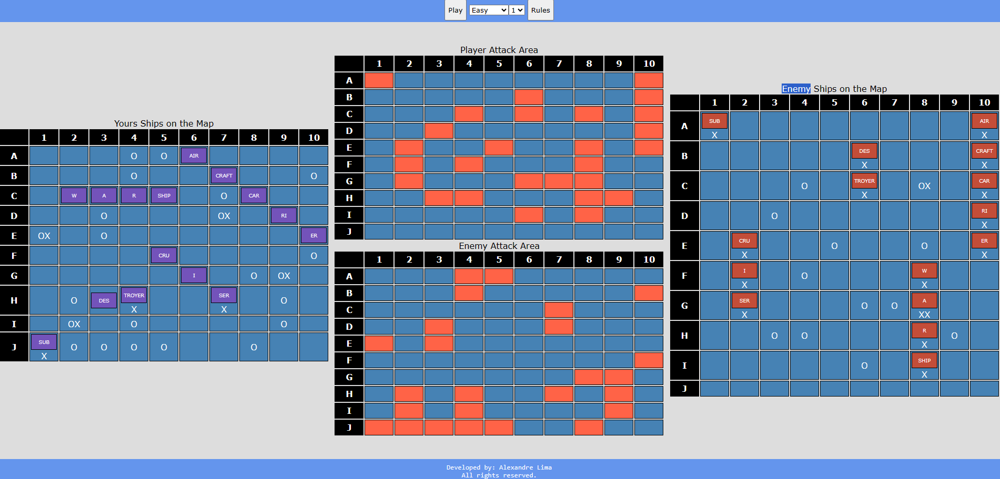

# 🚢 Battleship with HTML, CSS and JS ⚓

## Description ⚠️

> "In the game Battleship, you face off against the computer in a battle of naval strategy. You'll strategically position your fleet of ships on a grid, hidden from your opponent. Then, you take turns calling out coordinates to launch attacks on the computer's fleet, aiming to sink all of its ships before it sinks yours. The game requires keen deduction and tactical thinking to outsmart the computer and emerge as the victorious admiral."

## Requirements 🛠️🖥️

- <input type="checkbox" checked>Create port of War Table for Player and Computer.
- <input type="checkbox" checked>Create Ships Area Table for Player and Computer.
- <input type="checkbox" checked>Drag and drop effect for the positioning of the player's ships.
- <input type="checkbox" checked>Player Attack Table.
- <input type="checkbox" checked>Computer Attack Table.
- <input type="checkbox" checked>Logic for positioning enemy ships.
- <input type="checkbox" checked>Function to iterate over the table and find out if it is empty.
- <input type="checkbox" checked>Function that generates a number from 0 to 99.
- <input type="checkbox" checked> Implement difficulty levels: easy, medium, and hard.
- <input type="checkbox" checked> Allow ships to be positioned in vertical, horizontal and diagonal positions.
- <input type="checkbox" checked> Player Attack Function.
- <input type="checkbox" checked> Enemy Attack Function
- <input type="checkbox" checked> Attack effect in the enemy area and in the player's area.
- <input type="checkbox" checked> Create Player Win Rule.
- <input type="checkbox" checked> Create Enemy Win Rule
- <input type="checkbox" checked> Function to read the positions of the player's ships and check if all ships are affixed.
- <input type="checkbox" checked> Add sounds to the game.
- <input type="checkbox" checked> Correcting shots in the water and on ships with Position Relative and Absolute.
- <input type="checkbox" checked> Make sure the computer doesn't attack the same position.
- <input type="checkbox" checked> Make sure the player doesn't attack the same position.
- <input type="checkbox"> Create Game Restart System.
- <input type="checkbox"> Create Random Ship Position Generation.
- <input type="checkbox"> Remove permission to drag ships after starting the game.
- <input type="checkbox"> Better computer intelligence at the medium and hard level
- <input type="checkbox" checked> Add Music and Sounds.
- <input type="checkbox" checked> Add Music and Sounds.

## Print 📸

